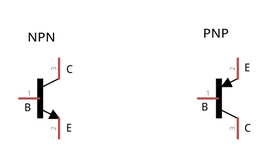
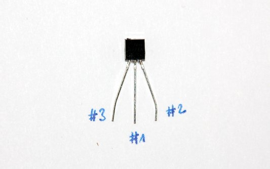

# Transistor

_Transistors provide amplification and/or switching capabilities._

* Semiconductor device with three or more elements are called Transistor
* Term derived from TRANSfer and resISTOR

Use-Cases:

* Control the flow of a much larger power/current then a controlling device
  (e.g. a micro-controller) can handle.
* Isolate different regions of complex circuits
* In small quantities used as simple switches, digital logic, and signal
  amplification circuits
* In big quantities used in Integrated Circuits (ICs) as part of computer
  memory, and microprocessors

## Bipolar Junction Transistor (BJT)

Three terminal to connect with a circuit:

| Terminal       | Abr. | Description                              |
|----------------|------|------------------------------------------|
| **Base**       | B    | Controls the flow of the current carrier |
| **Emitter**    | E    | Emits current carriers                   |
| **Collector**  | C    | Collects the current carriers            |

The voltage applied to base-emitter terminals controls the current at the 
collector terminal. A small current at the base of the transistor 
allows for a much larger current across the emitter and collector terminals.

Transistors are built by stacking three different layers of semiconductor
material together:

* A Material with extra electrons is called **n-type** (negative charge)
* A Material with electrons removed is called a **p-type**
* Transistors are created by stacking an n on top of a p on top of an n (NPN),
  or p over n over p (PNP)

**NPN** (Not Pointing iN) transistor

- Positive voltage to the collector and base terminals
- Switched "on" if there is **current at the base** terminal (high signal)
- If on, current flows from collector to emitter

**PNP** (Point iN) transistor

- Positive voltage to the emitter and negative voltage to the base terminal
- Switched "on" if there is **no current at the base** terminal (low signal)
- If on, current flows from emitter to collector

Schematic symbols for an NPN and PNP transistor:

The arrow in the schematic symbol points in the direction of hole flow,
electron flow is always toward (against) the arrow.

## Transistor Component

Following picture shows a **PN 2222A** NPN transistor:

(The flat face with text is the front side)

While the voltage on the transistor base (terminal #1) is below the threshold no current will flow between collector (terminal #3) and emitter (terminal #2). This transistor has a **threshold voltage** of **1V** (at the base) to switch on.

## Operation Modes

NPN transistor (flip polarity of > and < signs for an PNP transistor)

| Abr. | Description                       |
|------|-----------------------------------|
| Vᵇᵉ  | Voltage from base to emitter      |
| Vᵇᶜ  | Voltage from base to collector    | 
| Vᵗʰ  | Threshold voltage required at Vᵇᵉ |

| Mode           | State            | Description |
|----------------|------------------|-------------|
| Saturation     | Vᵉ < Vᵇ, Vᶜ < Vᵇ | The transistor acts like a **short circuit** between collector and emitter |
| Cut-Off        | Vᵉ > Vᵇ, Vᶜ > Vᵇ | The transistor acts like an **open circuit**: No collector and emitter current |
| Active         | Vᶜ > Vᵇ > Vᵉ     | Current going into the base pin **amplifies** current going into the collector and out the emitter |
| Reverse-Active | Vᶜ < Vᵇ < Vᵉ     | Like forward-active, but the current flows reverse |

## Measure NPN & PNP Transistors

Separate NPN from PNP transistors with an Ohm-meter:

- (Use alligator clamps to connect the probes.)
- Connect the positive probe of the meter to the base, and the negative to the
  collector. If the meter shows a reading then the transistor is an NPN. (Verify
  by measuring from base to emitter.)
- Connect the negative probe of the meter to the base, and the positive to the
  collector. If the meter shows a reading then the transistor is a PNP. (Verify
  by measuring from base to emitter.)

Assuming it is known if the transistor is NPN or PNP:

- Test the base-collector and base-emitter junctions like a standard diode. If
  one of the junctions does not behave like a diode then the transistor is bad.
- Check the resistance from collector to the emitter. The transistor is functional
  if there is an open circuit between collector and emitter.
- Some transistors have a diode from collector to emitter then a high resistance
  is measured between collector and emitter.
- Darlington transistors have a high reading from base to emitter and may appear
  as open on a volt-meter.
