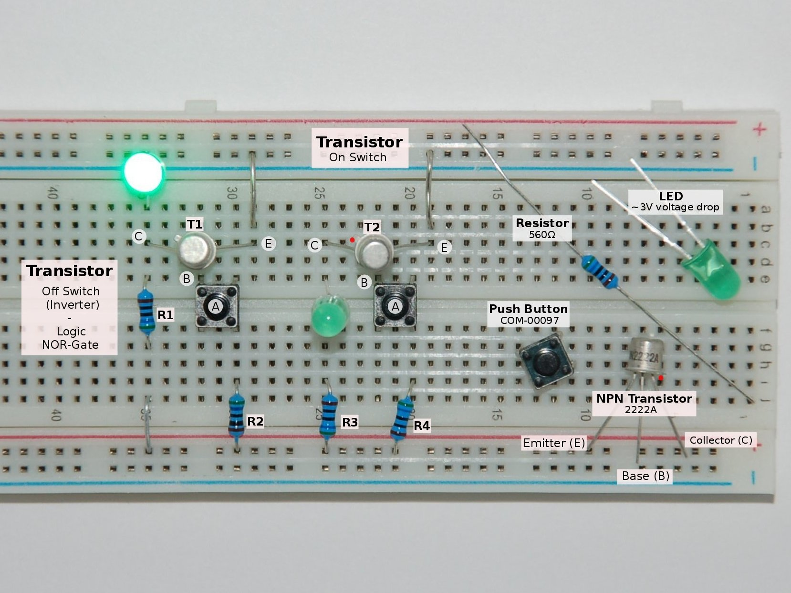

# Transistor On-Off Switch

The following picture shows two circuit:

List or required components:

| Pcs. | Description                  |
|------|------------------------------|
| 2    | NPN transistor (e.g PN2222A) |
| 2    | LED                          |
| 4    | Resistor  (e.g. 560Ω)        |
| 2    | Push Button (e.g. COM-00097) |
| 1    | Breadboard including wires   |

The base-emitter voltage of both transistors is controlled by push buttons. The on switch in the middle lights the LED if the button is pressed (enabling the A input):

Truth table (logic level "1" HIGH, and "0" LOW)

| A | Q |
|---|---|
| 0 | 0 |
| 1 | 1 |

## NOT Gate

The left circuit switches the LED off if the button is pressed. This is called an **inverter**, an represents the function of a **logic NOT gate**:

| A | Q |
|---|---|
| 0 | 1 |
| 1 | 0 |

The output Q from a NOT gate only return HIGH if the input is a logic level LOW.   

→ [Logic NOT Gate Tutorial](http://www.electronics-tutorials.ws/logic/logic_4.html)
